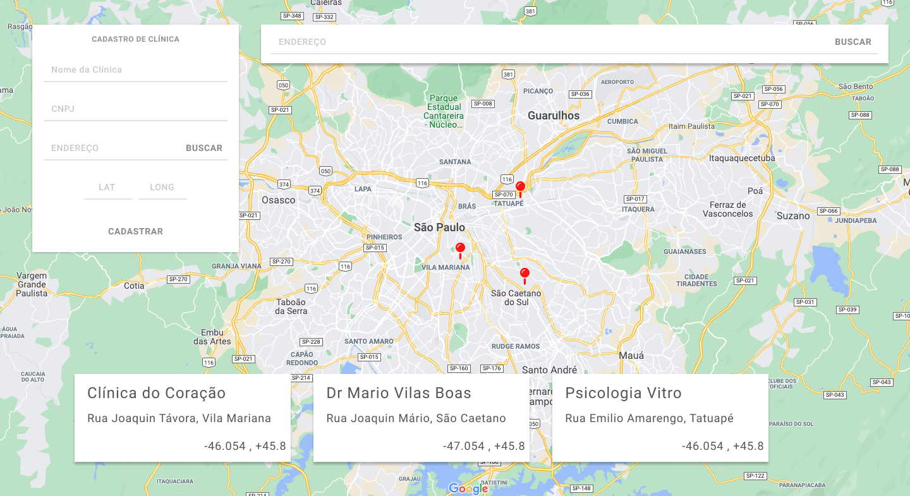

# Desafio - Desenvolvedor Fullstack

O objetivo deste desafio é avaliarmos o seu domínio em desenvolvimento fullstack, ou seja, sua organização, boas práticas com o código, criação e consumo de APIs Restfull, conhecimento dos frameworks e tecnologias utilizadas.

Um layout final bem elaborado e desenhado aponta para um diferencial seu, mas não é necessário se preocupar muito com o design. Afinal, não estamos buscando um designer para essa vaga! 

## Regras

1. Todo o seu código deve ser disponibilizado num repositório público ou privado em seu github ou bitbucket pessoal. Envie o link para wescleysp@gmail.com no prazo de 7 dias após o recebimento deste desafio;

2. Desenvolver o projeto utilizando: 
    - PostgreSQL, Express.js, React.js e Node.js(Typescript é um diferencial)
    - HTML e CSS (ou algum pré-processador)
    - [Google Geocode API](https://developers.google.com/maps/documentation/geocoding/intro?hl=pt-br) (se precisar de uma API Key do Google, basta solicitar por e-mail)
    - [Leaflet](http://leafletjs.com/) para manipulação do mapa. O mapa a ser utilizado pode ser qualquer um (Google, Mapbox, OSM, etc).

## O Desafio

Este é o layout que deverá ser produzido:

## Especificação das funcionalidades

Ao finalizar o desafio, o usuário deverá estar habilitado a cadastrar novas clínicas no formulário. Ao buscar a rede via geo-localização o mapa deverá pinar as clínicas da localização informada e carregar as clínicas nos cards inferiores.

#### POST /clinics

Você deve fazer um cadastro de clínicas, que terá os seguintes campos:
1. Nome
2. CNPJ
3. Endereço
    - Logradouro
    - Número
    - Bairro
    - Complemento
    - Cidade
    - Estado
    - País
    - Latitude
    - Longitude

Estes dados devem ser salvos numa tabla _clinics_ do PostgreSQL.

Note que no formulário há apenas um campo para colocar o endereço. Isso se deve ao fato de que o usuário deverá preencher apenas uma linha de endereço. Ao clicar em **Buscar**, os dados deste campo devem ser enviados à API do Google para buscar as informações de localização e incorporados ao objeto. Neste ponto, os campos de latitude e longitude devem ser preenchidos, mas devem ficar como _disabled_. Ao clicar em **Salvar**, salva os dados no banco, limpa o formulário e atualiza o mapa e a lista.

#### GET /clinics

A requisição GET para /clinics deve trazer um json com as informações das clínicas que existem no banco e exibí-las no mapa e na tabela.

### Algumas dicas e observações
> Obs 1.: Fique a vontade para utilizar qualquer 3rd party;

> Obs 2.: Considere que todos os campos são de preenchimento obrigatório no formulário.

> Obs 3.: Considere validar os campos também na API e em caso de inconsistência retornar erro num JSON estruturado com código HTTP 400

> Obs 4.: Não criamos uma versão responsiva no layout, adapte o layout para funcionar responsivamente em celulares.

## Dúvidas
Envie suas dúvidas diretamente para wescleysp@gmail.com ou abrindo uma issue.
